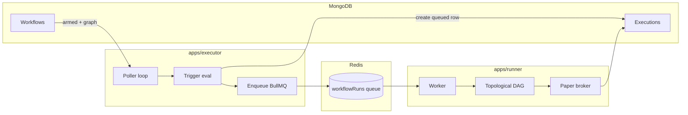

# Visual Workflow Automation Platform (TradeFlow)

A **Turborepo monorepo** for building visual, DAG-based workflows aimed at trading-style automation: users compose **triggers** and **actions** on a canvas, persist workflows and runs in **MongoDB**, and optionally execute automations via **Redis + BullMQ** workers using a **paper** (simulated) broker—not live exchange keys.

---

## Scope

### In scope today

| Area | What you get |
|------|----------------|
| **Product UI** | Landing, JWT sign-in/up, dashboard cards, React Flow workflow builder with trigger + action nodes, simulated execution-tracking page views. |
| **API** | Express (TypeScript): users, JWT auth, CRUD workflows & executions listing, seedable node catalog. |
| **Execution pipeline** | **Executor** polls `armed` workflows, evaluates timer/price triggers, enqueues BullMQ jobs. **Runner** consumes jobs, walks the DAG, runs paper trades / stub notify steps, updates Mongo execution documents. |
| **Shared contracts** | `packages/common`: Zod schemas for auth, workflows, nodes, executions so API & workers validate consistently. |

### Out of scope / limitations

| Topic | Reality |
|--------|---------|
| **Live exchanges** | No real order routing; [`paperBroker`](apps/runner/src/services/paperBroker.ts) simulates fills. Trigger “exchange” fields are UI/metadata. |
| **Dashboard & Executions screens** | They currently read **browser localStorage** drafts and simulated runs for UX—they are **not** yet wired end-to-end to `GET /api/workflows` / `GET /api/executions`. Auth and **Save** from the builder **do** use the API. |
| **Price data** | [CoinGecko](https://www.coingecko.com/) HTTP API (`coingecko`); SOL maps to Gecko id `solana`. Other symbols use lowercase Gecko `ids` strings—unsupported ids will fail until extended. Rate limits apply on free tier. |
| **Scheduling at scale** | Executor is a **single-loop poller**; no leader election or per-workflow cron service yet. |

---

## Functional overview

### User-facing flows

1. **Register / sign in** — JWT stored as `tradeflow.token` in `localStorage` ([`apps/web/src/lib/api.ts`](apps/web/src/lib/api.ts)).
2. **Build workflow** — One trigger node (price or timer) plus chained action nodes (`open-long`, `open-short`, `close-position`, `notify`).
3. **Save** — Persisted via `POST/PUT /api/workflows` (with optional local draft in [`apps/web/src/lib/workflows.ts`](apps/web/src/lib/workflows.ts)).
4. **Arm automation** — Set workflow `status` to `armed` (e.g. `PUT /api/workflows/:id` with `{ "status": "armed", ... }`). Only **armed** workflows are polled by the executor.
5. **Observe runs** — Executions stored in Mongo; list with bearer token via `GET /api/executions` (optional `?workflowId=`).

### How runs are created (architecture)



- **Triggers** (`apps/executor/src/index.ts`): **timer** uses last successful execution’s `finishedAt` vs `intervalMinutes`; first run fires when there is no prior success. **price** fetches USD price and compares via `below` / `above` (`apps/executor/src/services/triggerEval.ts`).
- **Runner** sorts action nodes respecting edges (`apps/runner/src/services/dag.ts`) and records step payloads on the execution document.

---

## Repository layout

| Path | Role |
|------|------|
| [`apps/web`](apps/web) | Vite + React + React Flow frontend |
| [`apps/api`](apps/api) | HTTP API (`/api/auth`, `/api/workflows`, `/api/executions`, `/api/nodes`) |
| [`apps/executor`](apps/executor) | Trigger polling + enqueue |
| [`apps/runner`](apps/runner) | Worker + DAG + paper broker |
| [`packages/common`](packages/common) | Shared Zod schemas / types |

Root scripts orchestrate Turborepo: `turbo dev`, `turbo build`, `turbo lint`, `turbo typecheck`.

---

## Prerequisites

- **Node.js** 20+ (recommended: current LTS; lockfiles target modern npm.)
- **npm** 10+ (workspaces-aware).
- **MongoDB** 6+ reachable from your machine (`mongod` locally, Docker, or [MongoDB Atlas](https://www.mongodb.com/cloud/atlas)).
- **Redis** 6+ reachable from executor + runner (local `redis-server`, Docker, or managed Redis URLs work if they speak the Redis protocol.)

Optional: **Docker Desktop** on Windows/macOS simplifies Mongo + Redis without local installs.

---

## Operating-system notes

### Windows (PowerShell / CMD)

- **Command chaining**: PowerShell 5.x does **not** support `cmd1 && cmd2` universally. Prefer **separate lines**, or use `cmd1; if ($?) { cmd2 }`, or **run commands from Git Bash**.
- **Line endings**: Git `core.autocrlf` is fine; Stack is Node-first—avoid editing `.env` with tools that strip newlines oddly.
- **MongoDB**: Official installer works; alternatively run Mongo in **WSL2** or Docker and point `MONGODB_URI` at that host (`127.0.0.1` vs WSL IP—use whatever `mongosh` succeeds against).
- **Redis**: Either [Memurai](https://www.memurai.com/) (Redis-compatible Windows), Redis inside **WSL2**, or Redis in **Docker**. Raw `redis-server` builds on native Windows are less common—Docker is usually easiest.
- **Native deps**: The stack is predominantly JavaScript; the web app may pull platform-specific Rollup binaries (e.g. Windows MSVC). If installs fail on an unusual CPU/arch, reinstall `node_modules` on that machine (`npm ci`).

### macOS / Linux

- Use **Homebrew** (macOS) or distro packages for `mongod`, `redis-server`, or Docker.
- **URLs**: `mongodb://127.0.0.1:27017/tradeflow` and `redis://127.0.0.1:6379` behave the same everywhere if services bind loopback.

### Atlas / TLS Mongo URIs

- Use Atlas “connection string”; include user/password **URL-encoded** special characters (`@`, `:`, `#`, etc.).
- If TLS options are encoded in URI query params (`tls=true`), official drivers handle them—as long as the Node process resolves DNS/firewall paths.

---

## Local setup (step by step)

### 1. Clone and install JavaScript deps

From the repository root:

```bash
cd /path/to/Visual-Workflow-Automation-Platform
npm install
```

This installs workspaces under `apps/*` and `packages/*`.

### 2. Start MongoDB and Redis

**Example: Docker (any OS with Docker)**

```bash
docker run -d --name tf-mongo -p 27017:27017 mongo:7
docker run -d --name tf-redis -p 6379:6379 redis:7
```

**Example: Native (macOS Homebrew)**

```bash
brew services start mongodb-community
brew services start redis
```

**Example: Native Linux** — use `systemctl` / package manager equivalents for `mongod` and `redis-server`.

Confirm connectivity before proceeding (Atlas: use Compass or `mongosh` with URI).

### 3. Configure environment variables

Tracked templates live beside each app; **copy to `.env` (gitignored)**:

| App | Copy command (bash) |
|-----|---------------------|
| API | `cp apps/api/.env.example apps/api/.env` |
| Executor | `cp apps/executor/.env.example apps/executor/.env` |
| Runner | `cp apps/runner/.env.example apps/runner/.env` |
| Web | `cp apps/web/.env.example apps/web/.env` |

PowerShell equivalents:

```powershell
Copy-Item apps\api\.env.example apps\api\.env
Copy-Item apps\executor\.env.example apps\executor\.env
Copy-Item apps\runner\.env.example apps\runner\.env
Copy-Item apps\web\.env.example apps\web\.env
```

#### `apps/api/.env`

| Variable | Required | Meaning |
|---------|----------|---------|
| `MONGODB_URI` | ✅ | Mongo connection string shared semantically across services. |
| `JWT_SECRET` | ✅ | Signing secret (**≥20 characters).** Rotate in production. |
| `PORT` | default `5000` | API listen port. |
| `WEB_ORIGIN` | default `http://localhost:5173` | Allowed CORS origin for the SPA. Must match wherever Vite serves the UI. |
| `JWT_EXPIRES_IN` | default `7d` | JWT TTL string passed to `jsonwebtoken`. |
| `NODE_ENV` | optional | `development` / `production` / `test`. |

#### `apps/executor/.env`

| Variable | Required | Meaning |
|---------|----------|---------|
| `MONGODB_URI` | ✅ | Same DB as API (reads workflows & executions). |
| `REDIS_URL` | ✅ | BullMQ + ioredis connection (e.g. `redis://127.0.0.1:6379`). Passworded URLs supported via standard Redis URI form. |
| `TRIGGER_POLL_INTERVAL_MS` | default `5000` | Executor sleep between full scans of armed workflows. |
| `PRICE_FEED_PROVIDER` | default `coingecko` | Only `coingecko` implemented. |

#### `apps/runner/.env`

| Variable | Required | Meaning |
|---------|----------|---------|
| `MONGODB_URI` | ✅ | Same DB—updates executions. |
| `REDIS_URL` | ✅ | Must match executor queue naming / Redis DB. |

#### `apps/web/.env`

| Variable | Required | Meaning |
|---------|----------|---------|
| `VITE_API_BASE_URL` | optional | Base URL **without trailing `/api`**. Defaults in code to `http://localhost:5000`. |

Ensure **JWT_SECRET**, **Mongo**, and **Redis** values agree across terminals when you split processes.

### 4. Seed the node catalog (optional but useful)

Requires API running:

```bash
curl -X POST http://localhost:5000/api/nodes/seed
```

`GET http://localhost:5000/api/nodes` lists catalog entries—no authentication required today.

---

## Run the complete project

### Option A — Turborepo (single command, noisy TUI)

From repo root (starts every package that declares a `dev` script: API, executor, runner, web):

```bash
npm run dev
```

**Caveats:** four processes contend for one Turbo UI; Mongo/Redis must already be up; watch each service’s stderr for failures.

### Option B — Four terminals (recommended for debugging)

1. **API**

   ```bash
   cd apps/api
   npm run dev
   ```

2. **Executor**

   ```bash
   cd apps/executor
   npm run dev
   ```

3. **Runner**

   ```bash
   cd apps/runner
   npm run dev
   ```

4. **Web**

   ```bash
   cd apps/web
   npm run dev
   ```

Open the URL Vite prints (typically **`http://localhost:5173`**). API defaults to **`http://localhost:5000`** (`GET /health` → `{ ok: true }`).

Health checks:

```bash
curl http://localhost:5000/health
```

---

## Builds, linting, typechecks

Whole repo via Turbo:

```bash
npm run build
npm run lint
npm run typecheck
```

Per app (inside `apps/<name>/`) the same scripts exist locally.

Production API:

```bash
cd apps/api
npm run build
npm run start
```

Executor / runner analogous (`npm run build` then `npm run start`).

---

## Test-style verification (manual)

Automated integration tests may not ship in-tree yet; validate behavior manually:

### 1. Auth + workflows API

```bash
curl -s -X POST http://localhost:5000/api/auth/register \
  -H "Content-Type: application/json" \
  -d "{\"email\":\"dev@example.com\",\"password\":\"Password123\",\"name\":\"Dev\"}"

# Sign in stores token printed as JSON `{ "token": "..." }` — reuse it:
export TOKEN="paste-jwt-here"

curl -s -H "Authorization: Bearer $TOKEN" http://localhost:5000/api/workflows
```

Create a workflow (minimal empty graph):

```bash
curl -s -X POST http://localhost:5000/api/workflows \
  -H "Authorization: Bearer $TOKEN" -H "Content-Type: application/json" \
  -d '{"name":"Demo","nodes":[],"edges":[]}'
```

### 2. Arm workflow + triggers

Builder saves React Flow-compatible `nodes` / `edges`. To arm programmatically:

```bash
WF_ID="<id-from-create-response>"
curl -s -X PUT "http://localhost:5000/api/workflows/$WF_ID" \
  -H "Authorization: Bearer $TOKEN" -H "Content-Type: application/json" \
  -d '{"status":"armed"}'
```

**Timer scenario:** Workflow includes a trigger node (`type`: `trigger`) with `data.triggerType === "timer"` and `intervalMinutes`. First executor pass creates a **queued** execution if no successful run existed.

**Price scenario:** `triggerType === "price"`, thresholds vs CoinGecko price; may need threshold aligned with volatile markets for demo.

Fetch executions:

```bash
curl -s -H "Authorization: Bearer $TOKEN" \
  "http://localhost:5000/api/executions?workflowId=$WF_ID"
```

### 3. Frontend sanity

After `npm run dev` in `apps/web`:

1. `/auth` — register/sign-in.
2. `/builder` — add trigger → chain action → Save.
3. `/dashboard`, `/executions` — inspect **local demo** listings (see limitations above).

### 4. Worker failure modes to watch

- Missing Redis → executor enqueue / runner bootstrap errors.
- Bad `MONGODB_URI` → all services refuse or crash parse.
- JWT/CORS mismatches (`WEB_ORIGIN` vs actual Vite port) → browser network errors on `/api/*`.

---

## Example scenarios

| Scenario | Setup | Expected outcome |
|----------|--------|-------------------|
| **Recurring checklist / timer ping** | Timer trigger (`intervalMinutes: 1`), one `notify` action, workflow `armed`. | Executor schedules runs each interval; runner appends simulated steps on execution docs. |
| **“SOL dip buyer” drill** | Price trigger SOL `below`, threshold unrealistically above market (temporary test) OR wait for volatility; armed workflow. | When condition true, queued job fires; actions run in DAG order via paper fills. |
| **Paper hedge path** | Linear graph: trigger → open-long → notify. | Topological order executes `open-long` then `notify` with recorded step metadata (see runner logs / Mongo documents). |

---

## Troubleshooting cheatsheet

| Symptom | Likely fix |
|---------|-------------|
| `Invalid environment variables` on boot | Populate missing keys; ensure `JWT_SECRET` length ≥ 20 (API only). |
| CORS blocked | Align `WEB_ORIGIN` exactly with SPA origin (`http://127.0.0.1:5173` vs `localhost` mismatches browsers). |
| BullMQ stalled | Executor + runner must share Redis URL + reachable DB identical to API-created workflows/users. |
| Price trigger never fires | Verify asset maps to Gecko id (`SOL`→`solana`); relax threshold; check outbound HTTP from executor host. |

---

## License / contributions

Specify your license here if applicable; contributions welcome via issues/PRs.

---

**Summary:** Install deps, run MongoDB + Redis, copy `.env.example` → `.env` for each runnable app, start API → executor → runner → web (`npm run dev` at root or four terminals). Use JWT flows for real persistence; Dashboard/Execution pages showcase UX with local previews until wired to REST list endpoints.
